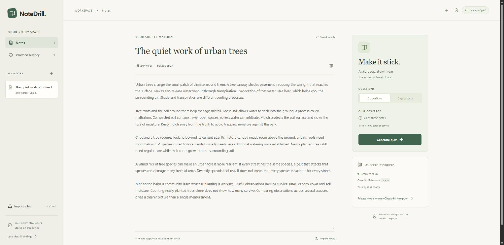
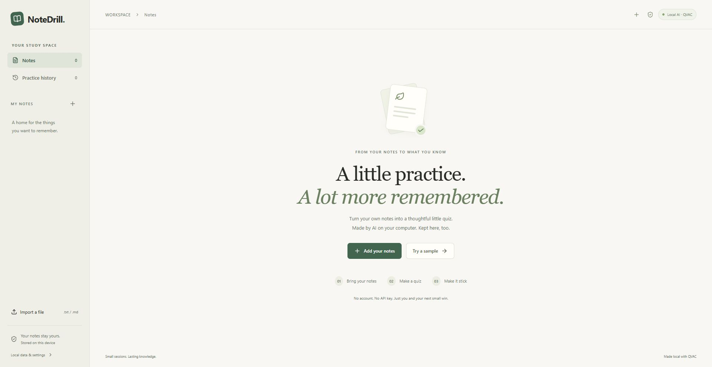
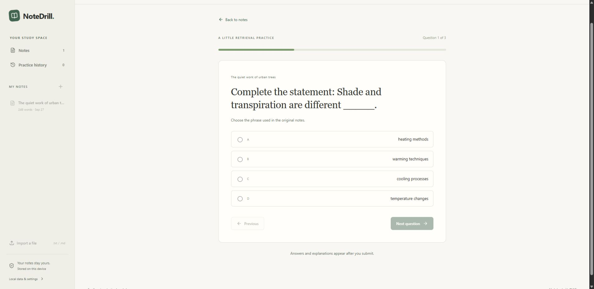
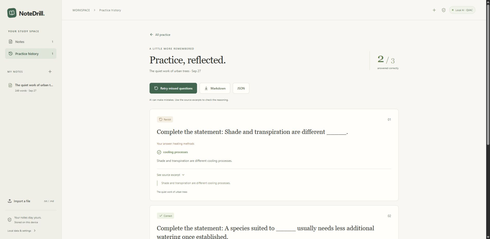

# NoteDrill

**Turn your own notes into short practice quizzes with AI running on your computer.** Paste text or import a file, make a quiz, then review every answer against the notes it came from.

**Local inference** · **No account or API key** · **3 or 5 questions** · **Saved practice**



[Get started](#get-started) · [See the app](#see-the-app) · [How local AI works](#how-local-ai-works) · [Developer commands](#developer-commands) · [Troubleshooting](#troubleshooting)

## Get started

Install **Node.js 24 LTS** (minimum 22.17), then run these commands in the repository:

```sh
npm ci
npm run doctor
npm run build
npm start
```

Open **[http://127.0.0.1:4317](http://127.0.0.1:4317)**. Use that exact address so the app can find its saved browser data. The first model preparation downloads **2.50 GB** and needs internet; quiz generation runs locally after preparation. Keep the terminal open while using the app.

> **Windows prerequisite:** QVAC documents **Vulkan 1.4+**, including for CPU inference. Install a current graphics driver and use `npm run doctor` to check the Vulkan loader. For the selected model, plan for roughly **16 GB of system RAM**, at least **4 GB available**, and several GB of disk space. See [platform notes](#platform-notes).

## See the app

| 1. Bring your notes | 2. Practice | 3. Review and revisit |
| --- | --- | --- |
| Paste text, import a UTF-8 `.txt` or `.md` file, or try the original sample lesson. Name and edit notes in the workspace. | Prepare the local model, choose 3 or 5 questions, and answer one question at a time. Answers stay hidden until submission. | See a deterministic score, open source excerpts, revisit saved attempts, retry missed questions, or export a quiz with its answer key. |

<details>
<summary><strong>Welcome screen</strong></summary>



</details>

<details open>
<summary><strong>Question view</strong></summary>



</details>

<details>
<summary><strong>Results and source evidence</strong></summary>



</details>

### What you can do

- **Build a library:** paste or import notes up to 100 KB each; rename, edit, and delete them. Notes and preferences persist across restarts in this browser.
- **Control coverage:** long notes show sections you can select. The app shows the selected excerpt and its size, so a quiz never silently claims to cover the whole document.
- **Stay in control:** see real model download progress, stop a generation through QVAC cancellation, and retry failed preparation or generation.
- **Keep practicing:** open past attempts, retry only missed questions, and preview, copy, or download Markdown and JSON exports.
- **Clear local data:** export the library first if you need a backup, then delete notes, quizzes, attempts, and preferences from the local-data dialog.

## How local AI works

NoteDrill uses **`@qvac/sdk` 0.20.0** directly in its Node service. The selected model is **`QWEN3_4B_INST_Q4_K_M`**, a quantized Qwen3 4B instruction model. The React interface calls only the service on `127.0.0.1`; there is no cloud AI endpoint, API key, analytics, or automatic cloud fallback.

The model selects a factual sentence, an answer phrase, three alternatives, and an explanation from the chosen notes. The app turns that sentence into a **fill-in-the-blank question**. It checks that the answer and explanation occur in the selected source, rejects malformed or repeated questions, and allows at most two local repair attempts per quiz. A second local completion reviews the choices. This format tests recall of the **original phrase in your notes**; it does not grade synonymous answers. AI can still make weak alternatives, so the review view shows the supporting excerpt.

Quiz scoring is ordinary application logic. Notes, quizzes, attempts, and preferences live in **IndexedDB** for this browser and origin. The Node service keeps only the current generation job in memory. Model files are cached outside the repository:

| Platform | Model cache |
| --- | --- |
| Windows | `%LOCALAPPDATA%\NoteDrill\models` |
| Linux/macOS | `$XDG_CACHE_HOME/notedrill/models`, or `~/.cache/notedrill/models` |

Releasing model memory keeps the cached weights. Scripts, styles, fonts, and icons are served locally. See [QVAC integration notes](docs/qvac-integration.md) for the inspected SDK API and configuration.

## Developer commands

| Command | Purpose |
| --- | --- |
| `npm run dev` | Start Vite and the local service; open `http://127.0.0.1:5173` |
| `npm run build` / `npm start` | Build and run the production app on `127.0.0.1:4317` |
| `npm run typecheck` / `npm test` | Check TypeScript and run focused unit tests |
| `npm run doctor` | Report Node, memory, platform, and Windows Vulkan diagnostics |
| `npm run test:smoke` | Load the real QVAC model and produce a short completion |
| `npm run test:live` | Generate a real 3-question quiz from the original sample lesson |
| `npm run test:live -- --five` | Generate a real 5-question quiz |
| `npm run test:cancel` | Exercise real SDK cancellation and recovery |
| `npm run test:production` | Generate through a running production service |

Run live inference commands **one at a time**, with the app's model memory released, to avoid competing for RAM. These checks use the original [sample lesson](sample-notes/urban-trees.md) and write sample-only results to ignored `.local/` files. The app itself does not log user notes or prompts.

### Platform notes

- **Windows:** development and live checks used Windows 11 x64 and Node 24.19.0. This machine's Vulkan loader reports 1.3.301; CPU inference worked, but that is below QVAC's documented 1.4+ requirement and is not a supported-platform claim.
- **Linux:** install `libatomic1`. NoteDrill runs the selected model in CPU mode. Linux was not tested here.
- **macOS:** the SDK supplies its native runtime. macOS was not tested here.
- **Production files:** keep `node_modules` beside `dist`; the Node service loads QVAC's worker and native assets from the installed packages.

### Offline check

The model is cached after preparation, but **network-isolated production startup and fresh generation remain unverified** on this machine because the current terminal lacks Administrator access for Windows Firewall rules. The included script blocks external traffic for the exact Node and Bare executables while preserving loopback:

```powershell
# First cache the model and stop NoteDrill. Then use an Administrator PowerShell:
powershell -NoProfile -File scripts/offline-windows.ps1
```

The script removes its temporary rules afterward. Browser offline mode alone cannot test the Node worker. See the [verification record](docs/verification.md) for the checks that passed and the remaining limits.

## Troubleshooting

<details>
<summary><strong>The app says Node is too old</strong></summary>

Install Node 24 LTS and reopen the terminal. On Windows, `where.exe node` and `Get-Command npm` help find a stale Node or npm shim.

</details>

<details>
<summary><strong>The model will not load</strong></summary>

Run `npm run doctor`. Update the GPU driver on Windows if Vulkan is missing or outdated; on Linux, check `libatomic1`. Close memory-heavy apps and retry preparation. A cold worker may take up to 90 seconds to start.

</details>

<details>
<summary><strong>The download stopped or the cache is corrupt</strong></summary>

Retry preparation with internet available; QVAC keeps partial downloads. Check free disk space. For a checksum failure, stop the app, remove its dedicated model cache shown in Local data & settings, then prepare again.

</details>

<details>
<summary><strong>The quiz cannot be generated or the service disconnected</strong></summary>

Add a few detailed paragraphs or select another section, then retry. Invalid model output gets at most two local regeneration attempts. If the service disconnected, run `npm start` and use Reconnect; the browser library remains available.

</details>

**Project references:** [QVAC integration](docs/qvac-integration.md) · [Verification record](docs/verification.md) · [Original sample notes](sample-notes/urban-trees.md)
